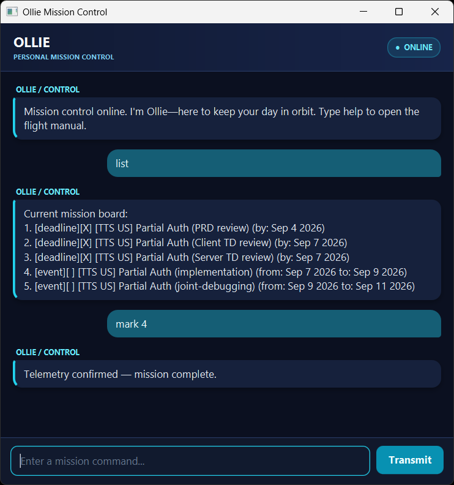

# Ollie Mission Control — User Guide

Keep your day in orbit with **Ollie**, a desktop task manager controlled through chat commands.
Log todos, track deadlines and events, and mark completed missions off your flight plan.



## Quick start

1. Install Java 25. Check your version by running `java -version` in a terminal.
2. Download the Ollie JAR from the [releases page](https://github.com/matthewtansh/ip/releases).
3. Put the JAR in a folder where you have permission to create and update files.
4. Open a terminal in that folder and run `java -jar "ollie.jar"`.
   If your downloaded file has a different name, use that name instead.
5. Type a command in the input box and press **Enter** or click **Transmit**.

Starting with an empty task list, enter these commands one at a time to recreate the
mission board in the screenshot:

```text
deadline [TTS US] Partial Auth (PRD review) /by 2026-09-04
deadline [TTS US] Partial Auth (Client TD review) /by 2026-09-07
deadline [TTS US] Partial Auth (Server TD review) /by 2026-09-07
event [TTS US] Partial Auth (implementation) /from 2026-09-07 /to 2026-09-09
event [TTS US] Partial Auth (joint-debugging) /from 2026-09-09 /to 2026-09-11
mark 1
mark 2
mark 3
list
mark 4
```

You can resize the window and scroll through earlier messages.

## Features

### Add a todo

A todo is a task without a date.

Format: `todo <description>`

Ollie replies `Mission logged and ready for launch.` The new task appears at the end of your list.
Use `list` to view it.

### Add a deadline

A deadline is a task with a due date.

Format: `deadline <description> /by <yyyy-MM-dd>`

Example: `deadline [TTS US] Partial Auth (PRD review) /by 2026-09-04`

Dates are displayed in a more readable format:

```text
[deadline][ ] [TTS US] Partial Auth (PRD review) (by: Sep 4 2026)
```

### Add an event

An event spans a start date and an end date.

Format: `event <description> /from <yyyy-MM-dd> /to <yyyy-MM-dd>`

Example: `event [TTS US] Partial Auth (implementation) /from 2026-09-07 /to 2026-09-09`

```text
[event][ ] [TTS US] Partial Auth (implementation) (from: Sep 7 2026 to: Sep 9 2026)
```

The start date must be earlier than the end date; same-day events are not supported.

### View and find tasks

Enter `list` to see your **Current mission board**, numbered from 1 in insertion order.
`[X]` means completed; `[ ]` means incomplete.

Before `mark 4` in the quick-start example, the board looks like this:

```text
Current mission board:
1. [deadline][X] [TTS US] Partial Auth (PRD review) (by: Sep 4 2026)
2. [deadline][X] [TTS US] Partial Auth (Client TD review) (by: Sep 7 2026)
3. [deadline][X] [TTS US] Partial Auth (Server TD review) (by: Sep 7 2026)
4. [event][ ] [TTS US] Partial Auth (implementation) (from: Sep 7 2026 to: Sep 9 2026)
5. [event][ ] [TTS US] Partial Auth (joint-debugging) (from: Sep 9 2026 to: Sep 11 2026)
```

Use `find <keyword>` to search task descriptions. For example, `find review` finds the PRD,
Client TD, and Server TD review tasks. Searches ignore letter case and match text within a
description; you can also search for a phrase such as `find Partial Auth`.
Dates and task-type labels are not searched.

Search results are numbered separately from the full list. Before marking, unmarking, or deleting
a task, run `list` and use its number from the full mission board, not the search results.
If there are no tasks or matches, Ollie shows only the relevant heading.

### Complete, reopen, or delete a task

Use the task's current number from `list`:

| Action                           | Command example | Result                                                            |
| -------------------------------- | --------------- | ----------------------------------------------------------------- |
| Complete the implementation task | `mark 4`        | Changes its status to `[X]`, as shown in the screenshot exchange. |
| Reopen the implementation task   | `unmark 4`      | Changes its status to `[ ]`.                                      |
| Delete the implementation task   | `delete 4`      | Removes it permanently from the list.                             |

These numbers refer to the five-task board above, without the additional todo example.

Task numbers change after deletion, so run `list` again before your next numbered command.
There is no undo command for deletion.

### Get help or end a session

Enter `help` to open the flight manual with all command formats.

Enter `bye` to end the chat session. Ollie displays a farewell and disables the input box and
Transmit button. Close the window normally; reopen Ollie to start another session.
`help`, `list`, and `bye` do not accept extra arguments.

## Saving your flight plan

Ollie automatically saves after a successful add, mark, unmark, or delete command.
There is no separate save command. Saved tasks are loaded when you first use a task-related
command in a new session.

Your tasks are stored in `data/ollie.txt`, relative to the folder where you launch Ollie.
On first use, a missing data file means an empty task list; Ollie creates the folder and file
when you first change the list. Always launch from the same folder to keep using the same data.
Back up `data/ollie.txt` if you want to preserve a copy of your tasks.

## Course corrections: fixing errors

Errors are highlighted in the chat with **Course correction needed** and an explanation.
Correct the command and try again.

| Problem                                           | How to correct it                                                                                                                                                                                                              |
| ------------------------------------------------- | ------------------------------------------------------------------------------------------------------------------------------------------------------------------------------------------------------------------------------ |
| Unknown command or missing description            | Type `help`, then use a supported format with a description.                                                                                                                                                                   |
| Missing, repeated, or misplaced date parameter    | Use one `/by` for deadlines, or one `/from` followed by one `/to` for events.                                                                                                                                                  |
| Invalid date, such as February 30                 | Enter a real date in `yyyy-MM-dd` format.                                                                                                                                                                                      |
| Invalid task number                               | Run `list` and use a positive whole number within the displayed range.                                                                                                                                                         |
| Task already has the requested status             | Use `unmark` to reopen a completed task, or `mark` to complete an incomplete one.                                                                                                                                              |
| Duplicate task                                    | Change the description or dates, or use the existing task. Tasks with the same type, description, and dates are duplicates even if their completion statuses differ; letter case and extra spaces in descriptions are ignored. |
| Task file cannot be read or contains invalid data | Check the launch folder and file permissions. Back up the file before repairing the reported line or restoring a known-good copy, then retry. Ollie does not silently replace invalid data.                                    |
| Task file cannot be saved                         | Ensure the launch folder and `data` folder are writable, and `data/ollie.txt` is a file rather than a folder. The attempted task-list change is reverted in memory; fix the problem and retry.                                 |
